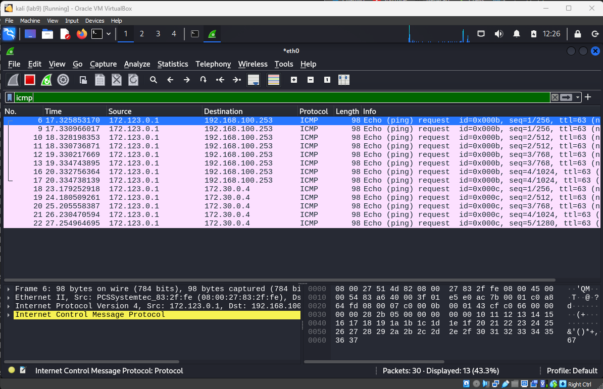
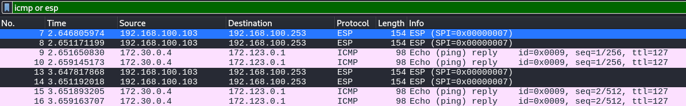
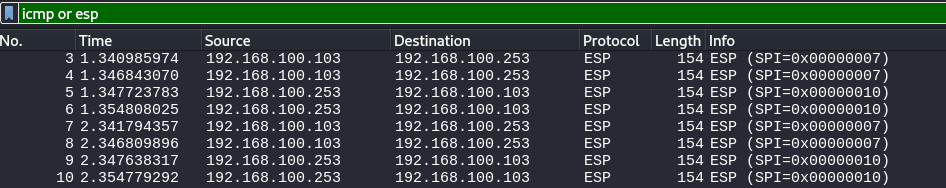

# Lab 10
## Set up the network
On remoterouter in `/etc/network/interfaces`:
```
auto enp0s8
iface enp0s8 inet static
 address 172.123.0.254
 netmask 255.255.255.0
auto enp0s3
iface enp0s3 inet static
 address 192.168.100.103
 netmask 255.255.255.0
 gateway 192.168.100.253
```
`sudo systemctl restart networking.service`

On companyrouter:
- Firewall uit(!)
```
sudo ip route add 172.123.0.0/24 via 192.168.100.103 dev eth0
```

On remoteclient:
- IP veranderen naar 172.123.0.1 (GUI)


On remoterouter:
```
sudo ip route add 172.123.0.0/24 via 192.168.100.103 dev eth0
```

On isprouter:
```
sudo ip route add 172.123.0.0/24 via 192.168.100.103 dev eth1
```
On ALL machines except isprouter:

`sudo nano /etc/sysctl.conf`

`net.ipv4.ip_forward=1` remove #

`sudo sysctl -p`


## DNS op remoteclient
- `sudo nano /etc/systemd/resolved.conf` (DNS regel)
- `sudo systemctl stop systemd-resolved`
- `sudo systemctl disable systemd-resolved`
- `sudo apt -y install resolvconf`
- `sudo nano /etc/resolvconf/resolv.conf.d/base`
- `nameserver 172.30.0.4` toevoegen in file
- `sudo resolvconf -u`

#### zie lab10network.md voor routes
- `cat /proc/sys/net/ipv4/ip_forward` check ipv4 forward
- check routes goed
- `/etc/network/interfaces`
- `systemctl restart networking`

#### network config ubuntu
- `/etc/netplan/01-network-manager-all.yaml`
```
network:
  version: 2
  renderer: networkd
  ethernets:
    enp0s3:
      addresses:
        - 192.168.100.107/24
      routes:
        - to: default
          via: 192.168.100.253
      nameservers:
          addresses: [8.8.8.8]
```
- `sudo netplan apply`
- routes van remoterouter en companyrouter op MITM attacker zetten
#### Network config kali
Op `kali`:
- `sudo systemctl stop networking`
- `sudo systemctl disable networking`

In `/etc/NetworkManager/NetworkManager.conf`:
```
[main]
plugins=ifupdown,keyfile

[ifupdown]
managed=true
```
- `sudo nmcli connection add type ethernet ifname eth0 con-name eth0 ipv4.method manual ipv4.addresses 192.168.100.102/24 ipv4.gateway 192.168.100.253 ipv4.dns 172.30.0.4`
```
nmcli connection modify eth0 ipv4.routes "172.30.0.0/16 192.168.100.253"
nmcli connection modify eth0 ipv4.routes "172.123.0.0/24 192.168.100.103"
nmcli connection modify eth0 ipv4.gateway "192.168.100.253"
```
```
sudo nmcli connection down "eth0"
sudo nmcli connection up "eth0"
```
- `sudo nmcli connection show`

## MitM attack
`sudo ettercap -Tq -i eth0 -M arp:remote /192.168.100.103// /192.168.100.253//`



## IPsec set-up: Encryption from remoterouter to companyrouter
Understanding the script:
- ```
  ip xfrm policy flush
  ip xfrm state flush
  ```
  - This clears any existing IPsec Security Associations (SA) and policies, ensuring you start with a clean slate
- ```
  SPI7=0x007
  ENCKEY7=0xFEDCBA9876543210FEDCBA9876543210
  ```
  - SPI7: Security Parameter Index (SPI), a unique identifier for this specific SA.
  - ENCKEY7: The encryption key used for the IPsec tunnel. In this case, it's a 128-bit AES key
-   ```
    ip xfrm state add \
        src 192.168.57.103 \
        dst 192.168.57.253 \
        proto esp \
        spi ${SPI7} \
        mode tunnel \
        enc aes ${ENCKEY7}
    ```
    - This command creates an SA that specifies how to encrypt packets from 192.168.57.103 (remoterouter) to 192.168.57.253 (companyrouter). It uses the AES encryption algorithm with the given key.
-   ```
    ip xfrm policy add \
        src 172.123.0.0/24 \
        dst 172.30.0.0/16 \
        dir out \
        tmpl \
        src 192.168.57.103 \
        dst 192.168.57.253 \
        proto esp \
        spi ${SPI7} \
        mode tunnel
    ```

On `remoterouter`:
- `sudo nano ipsecremote3.sh`
```bash
#!/usr/bin/env sh

# Manual IPSec

## Clean all previous IPsec stuff

ip xfrm policy flush
ip xfrm state flush

## The first SA vars for the tunnel from remoterouter to companyrouter

SPI7=0x007
ENCKEY7=0xFEDCBA9876543210FEDCBA9876543210

## Activate the tunnel from remoterouter to companyrouter

### Define the SA (Security Association)

ip xfrm state add \
    src 192.168.100.103 \
    dst 192.168.100.253 \
    proto esp \
    spi ${SPI7} \
    mode tunnel \
    enc aes ${ENCKEY7}

### Set up the SP using this SA

ip xfrm policy add \
    src 172.123.0.0/24 \
    dst 172.30.0.0/16 \
    dir out \
    tmpl \
    src 192.168.100.103 \
    dst 192.168.100.253 \
    proto esp \
    spi ${SPI7} \
    mode tunnel
```
- `sudo chmod +x ipsecremote3.sh`
- `sudo ./ipsecremote3.sh`

On `companyrouter`:
- `sudo nano ipseccompany3.sh`
```bash
#!/usr/bin/env sh

# Manual IPSec

## Clean all previous IPsec stuff

ip xfrm policy flush
ip xfrm state flush

## The first SA vars for the tunnel from remoterouter to companyrouter

SPI7=0x007
ENCKEY7=0xFEDCBA9876543210FEDCBA9876543210

## Activate the tunnel from remoterouter to companyrouter

### Define the SA (Security Association)

ip xfrm state add \
    src 192.168.100.103 \
    dst 192.168.100.253 \
    proto esp \
    spi ${SPI7} \
    mode tunnel \
    enc aes ${ENCKEY7}

### Set up the SP using this SA

ip xfrm policy add \
    src 172.123.0.0/24 \
    dst 172.30.0.0/16 \
    dir fwd \
    tmpl \
    src 192.168.100.103 \
    dst 192.168.100.253 \
    proto esp \
    spi ${SPI7} \
    mode tunnel
```
- `sudo chmod +x ipseccompany3.sh`
- `sudo ./ipseccompany3.sh`

Op Kali Ettercap + wireshark(filter= icmp or esp) aanzetten

Tijdens pingen van remoteclient naar dc:


Voor beide richtingen:

Op `remoterouter`:
- `sudo nano ipsecremote5.sh`
```bash
#!/usr/bin/env sh

SPI10=0x010
ENCKEY10=0xc259c1e9f71e3f6092c5efc9a6df737d645f7204c35b561e

ip xfrm state add \
    src 192.168.100.253 \
    dst 192.168.100.103 \
    proto esp \
    spi ${SPI10} \
    mode tunnel \
    enc aes ${ENCKEY10}

# Define the Security Policy (SP) for incoming traffic
ip xfrm policy add \
    src 172.30.0.0/16 \
    dst 172.123.0.0/24 \
    dir fwd \
    tmpl \
    src 192.168.100.253 \
    dst 192.168.100.103 \
    proto esp \
    spi ${SPI10} \
    mode tunnel
```
- `sudo chmod +x ipsecremote5.sh`
- `sudo ./ipsecremote3.sh`
- `sudo ./ipsecremote5.sh`

On `companyrouter`:
- `sudo nano ipseccompany5.sh`
```bash
#!/usr/bin/env sh

SPI10=0x010
ENCKEY10=0xc259c1e9f71e3f6092c5efc9a6df737d645f7204c35b561e

ip xfrm state add \
    src 192.168.100.253 \
    dst 192.168.100.103 \
    proto esp \
    spi ${SPI10} \
    mode tunnel \
    enc aes ${ENCKEY10}

# Define the Security Policy (SP) for incoming traffic
ip xfrm policy add \
    src 172.30.0.0/16 \
    dst 172.123.0.0/24 \
    dir out \
    tmpl \
    src 192.168.100.253 \
    dst 192.168.100.103 \
    proto esp \
    spi ${SPI10} \
    mode tunnel
```
- `sudo chmod +x ipseccompany5.sh`
- `sudo ./ipseccompany3.sh`
- `sudo ./ipseccompany5.sh`

