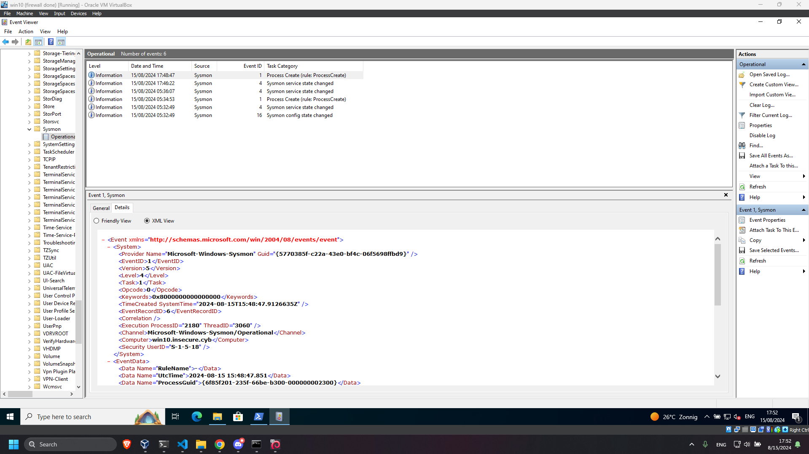
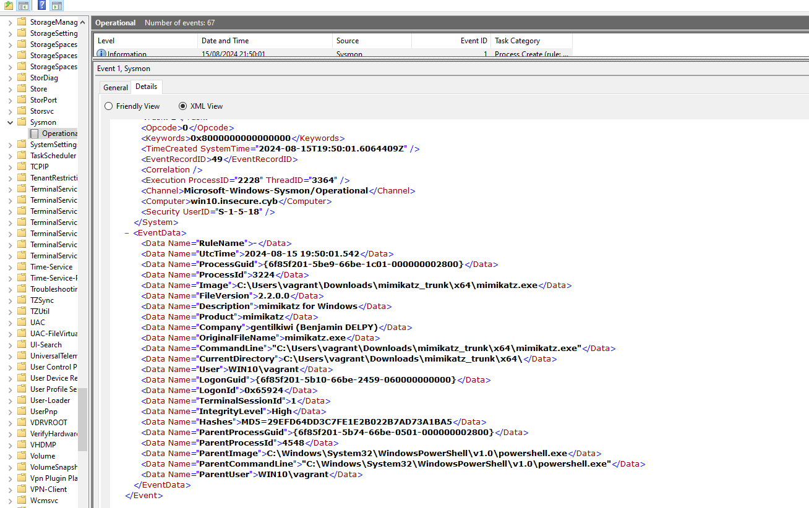
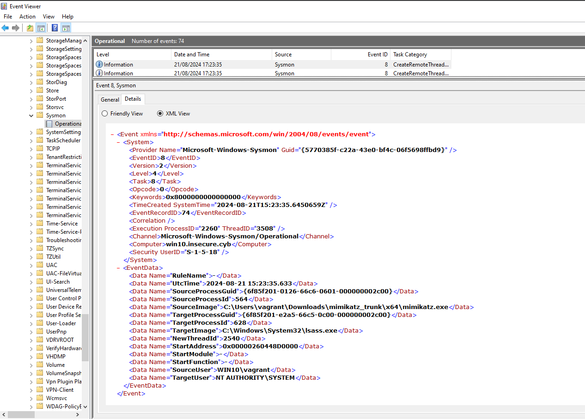

# Lab 9
## Wazuh VM
### VM config
- `sudo nano /etc/netplan/01-network-manager-all.yaml`
```yaml
network:
  version: 2
  ethernets:
    enp0s3:
      addresses:
        - 172.30.0.6/24
      routes:
        - to: default
          via: 172.30.0.254
      nameservers:
          addresses: [172.30.0.4]
```
- `sudo netplan apply`

DNS aanpassen:
- `sudo apt install resolvconf`
```
sudo systemctl start resolvconf.service
sudo systemctl enable resolvconf.service
sudo systemctl status resolvconf.service
```
- `sudo nano /etc/resolvconf/resolv.conf.d/head`
```
search insecure.cyb
nameserver 172.30.0.4
```
```
sudo resolvconf --enable-updates
sudo resolvconf -u
```
```
sudo systemctl restart resolvconf.service
sudo systemctl restart systemd-resolved.service
```
Bij booten VM altijd `sudo resolvconf -u`

### Wazuh installation
- `sudo apt  install curl -y`
- wazuh VM 4GB en 2 cores 
- `curl -sO https://packages.wazuh.com/4.8/wazuh-install.sh && sudo bash ./wazuh-install.sh -a`
```   
User: admin
Password: do3kA2?+1G6J702+IAq6k+oAFfCHkfQh
```
- https://172.30.0.6:443


### Wazuh agents (web,database,companyrouter)
Beste naar `su -` gaan:
```bash
sudo rpm --import https://packages.wazuh.com/key/GPG-KEY-WAZUH
```

```bash
cat > /etc/yum.repos.d/wazuh.repo << EOF
[wazuh]
gpgcheck=1
gpgkey=https://packages.wazuh.com/key/GPG-KEY-WAZUH
enabled=1
name=EL-\$releasever - Wazuh
baseurl=https://packages.wazuh.com/4.x/yum/
protect=1
EOF
```
Check goed dat enabled=1 anders aanpassen met sudo

```bash
sudo WAZUH_MANAGER="172.30.0.6" yum install wazuh-agent
```

```bash
systemctl daemon-reload
systemctl enable wazuh-agent
systemctl start wazuh-agent
```

```bash
sudo sed -i "s/^enabled=1/enabled=0/" /etc/yum.repos.d/wazuh.repo
```
- What is File Integrity Monitoring? Try to monitor the home directory of a user on a specific machine.
  - File Integrity Monitoring checks for changes to files and directories, such as modifications, deletions, or additions. It helps in detecting unauthorized changes and potential breaches

### Demo FIM Linux: 

- In `/var/ossec/etc/ossec.conf` line `<directories realtime="yes">/root</directories>` add :
```
  <!-- File integrity monitoring -->
  <syscheck>
    <disabled>no</disabled>

    <!-- Frequency that syscheck is executed default every 12 hours -->
    <frequency>60</frequency>

    <scan_on_start>yes</scan_on_start>

    <!-- Directories to check  (perform all possible verifications) -->
    <directories>/etc,/usr/bin,/usr/sbin</directories>
    <directories>/bin,/sbin,/boot</directories>
    <directories realtime="yes">/root</directories>
    <directories realtime="yes">/root</directories>
    <!-- Files/directories to ignore -->
    <ignore>/etc/mtab</ignore>
```
  - `sudo systemctl restart wazuh-agent`
  - `sudo touch /root/test`
```
[vagrant@web ~]$ sudo touch /root/test
[vagrant@web ~]$ sudo ls /root
laatste  test  testten
```
  - Op wazuh server naar `https://172.30.0.6:443`->klik op `web agent`->klik op `File integrity monitoring`-> we zien dat er een file is aangemaakt


### Demo FIM Windows:
In `C:\Program Files (x86)\ossec-agent\ossec.conf` onderaan `<directories realtime="yes">%USERPROFILE%</directories>` toevoegen voor FIM op `C:\Users\vagrant`  : 
```
  <!-- File integrity monitoring -->
  <syscheck>

    <disabled>no</disabled>

    <!-- Frequency that syscheck is executed default every 12 hours -->
    <frequency>43200</frequency>

    <!-- Default files to be monitored. -->
    <directories recursion_level="0" restrict="regedit.exe$|system.ini$|win.ini$">%WINDIR%</directories>

    <directories recursion_level="0" restrict="at.exe$|attrib.exe$|cacls.exe$|cmd.exe$|eventcreate.exe$|ftp.exe$|lsass.exe$|net.exe$|net1.exe$|netsh.exe$|reg.exe$|regedt32.exe|regsvr32.exe|runas.exe|sc.exe|schtasks.exe|sethc.exe|subst.exe$">%WINDIR%\SysNative</directories>
    <directories recursion_level="0">%WINDIR%\SysNative\drivers\etc</directories>
    <directories recursion_level="0" restrict="WMIC.exe$">%WINDIR%\SysNative\wbem</directories>
    <directories recursion_level="0" restrict="powershell.exe$">%WINDIR%\SysNative\WindowsPowerShell\v1.0</directories>
    <directories recursion_level="0" restrict="winrm.vbs$">%WINDIR%\SysNative</directories>

    <!-- 32-bit programs. -->
    <directories recursion_level="0" restrict="at.exe$|attrib.exe$|cacls.exe$|cmd.exe$|eventcreate.exe$|ftp.exe$|lsass.exe$|net.exe$|net1.exe$|netsh.exe$|reg.exe$|regedit.exe$|regedt32.exe$|regsvr32.exe$|runas.exe$|sc.exe$|schtasks.exe$|sethc.exe$|subst.exe$">%WINDIR%\System32</directories>
    <directories recursion_level="0">%WINDIR%\System32\drivers\etc</directories>
    <directories recursion_level="0" restrict="WMIC.exe$">%WINDIR%\System32\wbem</directories>
    <directories recursion_level="0" restrict="powershell.exe$">%WINDIR%\System32\WindowsPowerShell\v1.0</directories>
    <directories recursion_level="0" restrict="winrm.vbs$">%WINDIR%\System32</directories>

    <directories realtime="yes">%PROGRAMDATA%\Microsoft\Windows\Start Menu\Programs\Startup</directories>
    <directories realtime="yes">%USERPROFILE%</directories>
```
- `Restart-Service -Name wazuh`
- In `C:\Users\vagrant` nieuwe file maken
- Op wazuh server naar `https://172.30.0.6:443`->klik op `win10 agent`->klik op `File integrity monitoring`-> we zien dat er een file is aangemaakt


- What is meant with Regulatory Compliance? Give 2 frameworks that can be explored.
  - Ensures that systems and processes adhere to legal and regulatory requirements.
  - `GDPR` (General Data Protection Regulation): Europese wetgeving die gebaseerd op is het beschermen van de privacy een data van een individu.
  - `HIPAA` (Health Insurance Portability and Accountability Act): wetgeving die de gevoelige medische data van patiënten beschermt. 
  - `PCI-DSS` (Payment Card Industry Data Security Standard)

## Demo Threat hunting
- In `/var/ossec/etc/ossec.conf` die eerste syscheck block toevoegen:
```
  <!-- File integrity monitoring -->
  <syscheck>
    <directories>/home/*/.bash_history</directories>
    <directories>/home/*/.zsh_history</directories>
    <directories>/root/.bash_history</directories>
    <directories>/root/.zsh_history</directories>
    <frequency>60</frequency>
    <alert_new_files>yes</alert_new_files>
  </syscheck>
  <syscheck>
    <disabled>no</disabled>
```
- `sudo systemctl restart wazuh-agent`
- `export PROMPT_COMMAND="history -a; $PROMPT_COMMAND"` (zodat commands direct naar .bash_history gaan)
- `export HISTFILE=~/.bash_history`
- `sudo date`
- - Op wazuh server naar `https://172.30.0.6:443`->klik op `web agent`->klik op `Threat hunting`-> Onder `Security alerts` klikken op `Successful sudo to ROOT executed` -> je kan command zien

## Sysmon
- Download Sysmon op win10
- create `sysconfig.xml` in zelfde folder als Sysmon binaries:
```
<Sysmon schemaversion="4.10">
   <HashAlgorithms>md5</HashAlgorithms>
   <EventFiltering>
      <!--SYSMON EVENT ID 1 : PROCESS CREATION-->
      <ProcessCreate onmatch="include">
         <Image condition="contains">mimikatz.exe</Image>
      </ProcessCreate>
      <!--SYSMON EVENT ID 2 : FILE CREATION TIME RETROACTIVELY CHANGED IN THE FILESYSTEM-->
      <FileCreateTime onmatch="include" />
      <!--SYSMON EVENT ID 3 : NETWORK CONNECTION INITIATED-->
      <NetworkConnect onmatch="include" />
      <!--SYSMON EVENT ID 4 : RESERVED FOR SYSMON STATUS MESSAGES, THIS LINE IS INCLUDED FOR DOCUMENTATION PURPOSES ONLY-->
      <!--SYSMON EVENT ID 5 : PROCESS ENDED-->
      <ProcessTerminate onmatch="include" />
      <!--SYSMON EVENT ID 6 : DRIVER LOADED INTO KERNEL-->
      <DriverLoad onmatch="include" />
      <!--SYSMON EVENT ID 7 : DLL (IMAGE) LOADED BY PROCESS-->
      <ImageLoad onmatch="include" />
      <!--SYSMON EVENT ID 8 : REMOTE THREAD CREATED-->
      <CreateRemoteThread onmatch="include">
         <SourceImage condition="contains">mimikatz.exe</SourceImage>
      </CreateRemoteThread>
      <!--SYSMON EVENT ID 9 : RAW DISK ACCESS-->
      <RawAccessRead onmatch="include" />
      <!--SYSMON EVENT ID 10 : INTER-PROCESS ACCESS-->
      <ProcessAccess onmatch="include">
         <SourceImage condition="contains">mimikatz.exe</SourceImage>
      </ProcessAccess>
      <!--SYSMON EVENT ID 11 : FILE CREATED-->
      <FileCreate onmatch="include" />
      <!--SYSMON EVENT ID 12 & 13 & 14 : REGISTRY MODIFICATION-->
      <RegistryEvent onmatch="include" />
      <!--SYSMON EVENT ID 15 : ALTERNATE DATA STREAM CREATED-->
      <FileCreateStreamHash onmatch="include" />
      <PipeEvent onmatch="include" />
   </EventFiltering>
</Sysmon>
```
- met Admin rechten `Sysmon64.exe -accepteula -i sysconfig.xml`
- Download mimikatz op win10
- `cd C:\Users\vagrant\Downloads\mimikatz_trunk\x64`
- `.\mimikatz.exe`
- Open `Event viewer`->`Applications and Services Logs`-> `Microsoft`-> `Windows`->`Sysmon`->`Operational`


### Configure win10 als wazuh agent
```powershell
# Voorbeeld URL van de installer
$url = "https://packages.wazuh.com/4.x/windows/wazuh-agent-4.8.0-1.msi"

# Bestemming voor het opslaan van de gedownloade installer
$output = "C:\Users\vagrant\Downloads\wazuh-agent-4.8.0-1.msi"

# Voer de download uit met Invoke-WebRequest
Invoke-WebRequest -Uri $url -OutFile $output
```
- `.\wazuh-agent-4.8.1-1.msi /q WAZUH_MANAGER="172.30.0.6"`
- `NET START Wazuh`
- In GUI -> `View` -> `View config` -> `<address>172.30.0.6</address>`
- `cd 'C:\Program Files (x86)\ossec-agent\'`
- `.\agent-auth.exe -m 172.30.0.6`
- Refresh op wazuh GUI
- `cd 'C:\Program Files (x86)\ossec-agent\'`
- `notepad .\ossec.conf`
```
<localfile>
  <location>Microsoft-Windows-Sysmon/Operational</location>
  <log_format>eventchannel</log_format>
</localfile>
```
- `net stop wazuh`
- `net start wazuh`
- op wazuh manager:
- `sudo nano /var/ossec/etc/rules/local_rules.xml`
```
<group name="windows, sysmon, sysmon_process-anomalies,">
   <rule id="100000" level="12">
     <if_group>sysmon_event1</if_group>
     <field name="win.eventdata.image">mimikatz.exe</field>
     <description>Sysmon - Suspicious Process - mimikatz.exe</description>
   </rule>
   <rule id="100001" level="12">
     <if_group>sysmon_event8</if_group>
     <field name="win.eventdata.sourceImage">mimikatz.exe</field>
     <description>Sysmon - Suspicious Process mimikatz.exe created a remote thread</description>
   </rule>
   <rule id="100002" level="12">
     <if_group>sysmon_event_10</if_group>
     <field name="win.eventdata.sourceImage">mimikatz.exe</field>
     <description>Sysmon - Suspicious Process mimikatz.exe accessed $(win.eventdata.targetImage)</description>
   </rule>
</group>
```
- `sudo systemctl restart wazuh-manager`
```
C:\Users\Walt\Downloads\mimikatz_trunk\x64\
.\mimikatz.exe
lsadump::lsa /inject
```


