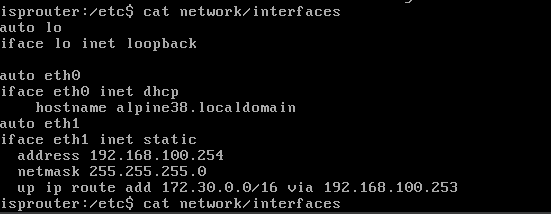

## Recap Wireshark
- What layers of the OSI model are captured in this capturefile?
  *   layer2: arp, ethernet
  *   layer 3:ipv6, ipv4,icmp 
  *  layer 4:tcp,udp
  *  layer 7: dns,http,ssh

- Take a look at the conversations. What do you notice?
  * 8 adressen communiceren met elkaar waarvan het meest van 172.30.42.2 naar 172.30.128.10

- Take a look at the protocol hierarchy. What are the most "interesting" protocols listed here?
  * Ipv6,DNS,SSH,HTTP,ICMP,ARP

- Can you spot an SSH session that got established between 2 machines? List the 2 machines. Who was the SSH server and who was the client? What ports were used? Are these ports TCP or UDP?
  *   client: 172.30.128.10 
  *  server: 172.30.42.2
  *  clientport: 37700
  *  serverport: 22
  *  These ports are TCP
  *  `{"cmd":"ip a"}`:
    iemand heeft een command 'ip a' uitgevoerd en kreeg 
    ```console
    '{"output":"1: lo: <LOOPBACK,UP,LOWER_UP> mtu 65536 qdisc noqueue state UNKNOWN group default qlen 1000\n    link/loopback 00:00:00:00:00:00 brd 00:00:00:00:00:00\n    inet 127.0.0.1/8 scope host lo\n       valid_lft forever preferred_lft forever\n    inet6 ::1/128 scope host \n       valid_lft forever preferred_lft forever\n2: enp0s3: <BROADCAST,MULTICAST,UP,LOWER_UP> mtu 1500 qdisc fq_codel state UP group default qlen 1000\n    link/ether 08:00:27:ff:48:12 brd ff:ff:ff:ff:ff:ff\n    inet 10.0.2.15/24 brd 10.0.2.255 scope global dynamic noprefixroute enp0s3\n       valid_lft 80969sec preferred_lft 80969sec\n    inet6 fe80::a00:27ff:feff:4812/64 scope link noprefixroute \n       valid_lft forever preferred_lft forever\n3: enp0s8: <BROADCAST,MULTICAST,UP,LOWER_UP> mtu 1500 qdisc fq_codel state UP group default qlen 1000\n    link/ether 08:00:27:99:d4:ca brd ff:ff:ff:ff:ff:ff\n    inet 172.30.42.2/26 brd 172.30.42.63 scope global noprefixroute enp0s8\n       valid_lft forever preferred_lft forever\n    inet6 fe80::a00:27ff:fe99:d4ca/64 scope link noprefixroute \n       valid_lft forever preferred_lft forever\n"}'
    ``` 
    als output
- 
    There are 2 .png files that can easily be exported, these are the files that are exported
    - .png)
    - 

## Capture traffic using the cli
- `route add -net 172.30.0.0 netmask 255.255.0.0 gw 192.168.100.253` doen op isprouter zodat we van 172.30.0.0 kunnen pingen naar 192.168.100.0 netwerk
- Which interface on the companyrouter will you use to capture traffic from the dc to the internet?
  * interface eth1
- Which interface on the companyrouter would you use to capture traffic from dc to win10?
  * interface eth1
- Test this out by pinging from win10 to the companyrouter and from win10 to the dc.Are you able to see all pings in tcpdump on the companyrouter? 
  * no u cant see the pings from win10 to dc but we can see pings from win10 to companyrouter
- SSH from win10 to the companyrouter. When scanning with tcpdump you will now see a lot of SSH traffic passing by. How can you start tcpdump and filter out this ssh traffic?
  * sudo tcpdump -i any host 172.30.10.100 not port 22

- Start the web VM. Find a way to capture only HTTP traffic and only from and to the webserver-machine. Test this out by browsing to http://www.insecure.cyb from the isprouter machine using curl. This is a website that should be available in the lab environment. Are you able to see this HTTP traffic? Browse on the win10 client, are you able to see the same HTTP traffic in tcpdump, why is this the case?
  * sudo tcpdump -i eth0 src 172.30.0.10 and dst port 80 or dst 172.30.0.10 and src port 80
  * We are not able to see the HTTP traffic because it is filtered so  that only the web VM will get captured but the web VM does not need the companyrouter  to access its own site, therefore we wont see anything in the capture file on the companyrouter

## understanding the network + attacker machine red
* What did you have to configure on your red machine to have internat and to properly ping web?
  - I had to assign an ip address to the VM (192.168.100.102/24) and set the default gateway to 192.168.100.254 to access the internet.
* What is the default gateway of each machine?
  - dc,win10,web,database: 172.30.255.254
  - companyrouter,red: 192.168.100.254
  - isprouter: 10.0.2.2
* What is the DNS server of each machine?
  - dc: 127.0.0.1 (::1)
  - win10,web,database:172.30.0.4
  - companyrouter,isprouter:10.0.2.3
  - red:192.168.1.1
* Which machines have a static IP and which use DHCP?
  - All machines have a static IP except for win10
* What routes should be configured and where, how do you make it persistent?
  - A route needs to be configured on the isprouter for traffic coming from the 172.30.0.0/16 netwerk via companyrouter, we can make it persistent by editing the file `/etc/network/interfaces` and adding the following line 
  ```bash
  up ip route add 172.30.0.0/16 via 192.168.100.253
  ```
   
   after that we need to execute the following command: `rc-service staticroute start` or restart the server

* Which users exist on which machines?
  - `getent passwd {1000..60000}`
  - isprouter,companyrouter,web,database: vagrant
  - red: osboxes
  - win10(`get-localuser`): Administrator,DefaultAccount,Guest,Vagrant
  - dc: Administrator,Guest,krbtgt,vagrant,walt,bdup,Aladdin,Jasmine,Genie,Jafar,Iago,Abu,Carpet,Sultan,Rajah,Simba,Nala,Timon,Pumbaa,Scar,Mufasa,Zazu,Rafiki,Sarabi,Sarafina,Shenzi,Banzai,Ed,Gopher,DC$
  
* What is the purpose (which processes or packages for example are essential) of each machine?
  - dc: runs Active Directory, managing user accounts for network, DNS server
  - web: hosts an unsecure HTTP web server
  - database: hosts a database
  - win10: windows 10 client device that represents an end user
  - companyrouter: serves as gateway between internal company network and 'fake internet'
  - isprouter: provides internet access, acts as a fake ISP router
  - red: attacker machine that will execute several attacks on the internal company network

* Investigate whether the DNS server of the company network is vulnerable to a DNS Zone Transfer "attack" as discussed above. What exactly does this attack involve? If possible, try to configure the server to prevent this attack. Document this update: How can you execute this attack or check if the DNS server is vulnerable and how can you fix it? Can you perform this "attack" both on Windows and Linux? Document your findings properly.
  - `dig @172.30.0.4 insecure.cyb axfr` this attack lets a rogue device act as a secondary DNS server and request a zone transfer and with that it can get info about the IPs of the network
  - yes it can be done on windows too with `nslookup`->`server dc.insecure.cyb`->`set type=any`->`ls -d insecure.cyb`
  - we can prevent this by doing the following on DC:`Set-DnsServerPrimaryZone -Name "insecure.cyb" -securesecondaries NoTransfer`